# 当前数据库关系与页面取数

> 12.x 设置基础迁移见 [032_system_settings.sql](../db/migrations/032_system_settings.sql)，模型连接与安全审计见 [033_model_connections.sql](../db/migrations/033_model_connections.sql)，保留策略见 [034_retention_policy.sql](../db/migrations/034_retention_policy.sql)，备份作业见 [045_backup_jobs.sql](../db/migrations/045_backup_jobs.sql)；公开仓库连接、扫描与分析见 [046_project_repositories.sql](../db/migrations/046_project_repositories.sql)、[047_project_scans.sql](../db/migrations/047_project_scans.sql)、[048_project_scan_content.sql](../db/migrations/048_project_scan_content.sql)、[049_project_analyses.sql](../db/migrations/049_project_analyses.sql)、[050_project_model_audit.sql](../db/migrations/050_project_model_audit.sql)、[051_project_analysis_recovery.sql](../db/migrations/051_project_analysis_recovery.sql)、[052_project_analysis_modules.sql](../db/migrations/052_project_analysis_modules.sql)、[053_project_module_analysis.sql](../db/migrations/053_project_module_analysis.sql)、[054_project_suggestion_decisions.sql](../db/migrations/054_project_suggestion_decisions.sql)、[055_project_finding_feedback.sql](../db/migrations/055_project_finding_feedback.sql)、[056_project_technology_evidence.sql](../db/migrations/056_project_technology_evidence.sql) 和 [057_project_suggestion_priorities.sql](../db/migrations/057_project_suggestion_priorities.sql)。迁移后数据库共有 108 张表。

## 系统设置与个人偏好

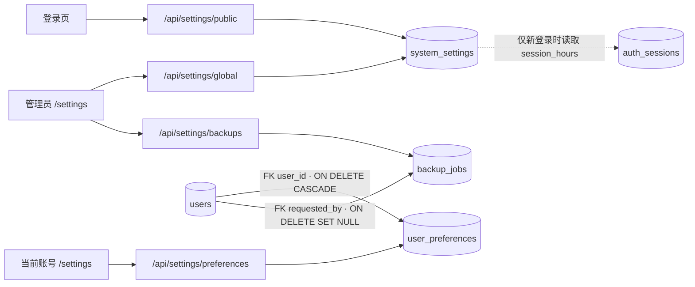

`system_settings` 是 ID 固定为 1 的单行全局配置，包含系统名称、公开 Logo URL、默认时区／语言／日期格式／分页条数和新登录有效期。`user_preferences` 以 `user_id` 为主键并外键关联 `users.id`；个人时区、语言和日期格式为空时继承全局值，主题、主色与密度按账号保存。两个设置写入接口均使用版本号拒绝过期覆盖。登录会话仍由 `auth_sessions` 保存，修改有效期不会改写旧会话的 `expires_at`。目前仅品牌、基础主题和主要列表分页使用这些设置；全站双语、统一日期展示及自绘图表主题仍在 12.1／12.6 的后续工作中。

`backup_jobs` 保存管理员手动备份的执行状态、阶段、文件大小和结果码，`requested_by` 外键指向 `users.id`，删除账号后置空。加密归档位于本地 `backups/`，文件名由作业 UUID 派生；密钥只从服务端环境变量读取，不存入数据库。后台作业启动时使用独立数据库连接生成 PostgreSQL dump，加入附件后验证加密归档；重启时未完成的作业标记为失败。自动备份、增量链和旁路恢复尚未实现。

## 模型连接与安全审计

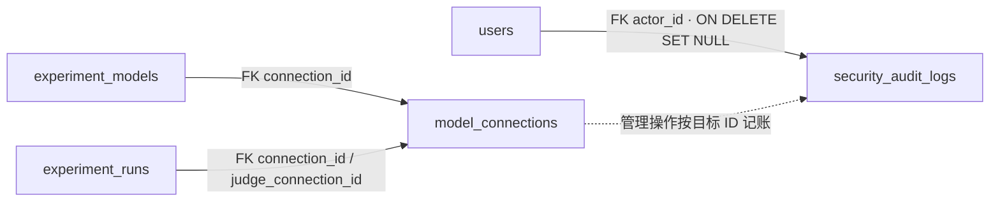

`model_connections` 可为同一供应商保存多条连接，只有一个启用的默认连接；API Key 和自定义 X- 请求头分别以 AES-256-GCM 加密，数据库行记录密钥版本与脱敏显示值。显式绑定的模型通过 `experiment_models.connection_id` 选择连接；创建运行时将主模型与 Judge 的连接 ID 复制到 `experiment_runs`，运行器按该 ID 取密钥。未绑定模型选供应商默认数据库连接，无默认连接才使用旧环境变量。`security_audit_logs` 是独立安全审计表，保存管理动作、操作者及目标 ID，不保存明文密钥；与任务字段历史、笔记版本历史区分。[036_model_registry.sql](../db/migrations/036_model_registry.sql) 扩展 `experiment_models` 的唯一名称、Endpoint／API 版本元数据、token 上限、能力标签、状态和角色白名单；[042_model_retirement.sql](../db/migrations/042_model_retirement.sql) 增加弃用、计划退役和实际退役时间，**不增加新表或外键**。旧模型保留成员可见权限；新增模型默认仅管理员可用。未接入的供应商只能登记目录，不能启用或执行；Endpoint 暂不覆盖加密连接的实际请求地址。运行单价仍按美元／百万 token 存储，管理表单换算显示美元／千 token。到期退役器按 `retire_at` 自动把状态改为 `retired`，排队运行标记失败；引用者通知存于 `app_notifications`，紧急退役写入 `security_audit_logs`。

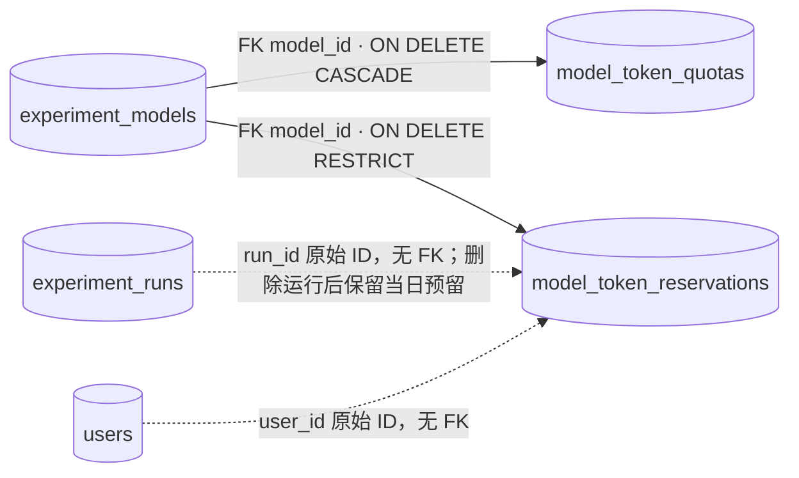

`model_token_quotas` 用 `(model_id, scope, subject_id)` 唯一定位模型默认、角色或账号规则；模型规则的 subject 为 `*`。优先级为用户 > 角色 > 模型，模型默认表示**每账号**的默认日上限。`model_token_reservations` 按 UTC 日期保存已接受运行的保守 token 上限；它故意不对运行或账号设外键，使删除运行或账号不会重置当天已占额度。主模型与 Judge 若相同，在同一运行内合并预留。入队在事务和数据库锁下检查总预留，超过上限返回 429 与下一 UTC 日的 `Retry-After`；达到 80%／90%／100% 生成去重站内通知。当前预留不会按实际结果回退，准确消耗核算须等 9.5 逐次调用审计完成；媒体模型配置配额前须设置上下文窗口，避免无界估算。

`model_rate_limits` 以模型 ID 为主键，外键到 `experiment_models.id`（删除模型时级联删除规则）。`model_rate_reservations` 以 `(run_id, model_id)` 为主键，`model_id` 外键到模型，`run_id` 为无外键原始 ID；每行保存 UTC 分钟、保守请求次数和 token 上限。`/api/model-rate-status` 只汇总当前分钟。批次入队与日配额使用相同事务，在另一个数据库锁下检查 RPM／TPM；任一超限整批返回 429 和下一分钟 `Retry-After`。超过 90% 的分钟按模型去重通知管理员。旧分钟预留在后续批次入队时清理；实际调用与失败释放仍待 9.5。

`model_call_audit` 以 UUID `request_id` 为主键，记录实际模型 HTTP 调用的运行 ID、主模型或 Judge 环节、尝试次数、账号 ID、模型 ID、模块、脱敏提示词预览、token 用量、延迟、HTTP 状态与失败代码。模块允许实验、评测及项目分析；项目分析审计只记录“仓库代码输入已省略”占位符，不复制仓库正文。运行、模型和账号 ID 故意不设外键，永久删除业务实体后在保留期内仍可核对调用。`/model-call-audit` 只允许管理员检索；聊天端会话尚未接入本地模型适配器，因此无可信调用事实可写。模型审计和独立安全审计日志都按 `retention_settings.audit_days` 清理，默认 90 天。

`model_security_policies` 以 `model_id` 为主键及指向 `experiment_models.id` 的级联外键，按模型保存输入 PII／越狱、输出 PII 开关与敏感词／品牌风险词表及并发版本。`model_security_events` 保存模型和运行原始 ID、主模型或 Judge 环节、输入／输出方向、命中规则及阻断／替换动作，**不保存命中原文且不设模型或运行外键**，使历史审计可保留至配置的审计期限。管理员通过模型设置抽屉读取和修改策略；模型调用适配器先检查文本输入，再调用提供商，返回文本输出时执行替换。媒体内容与工具参数尚未扫描。

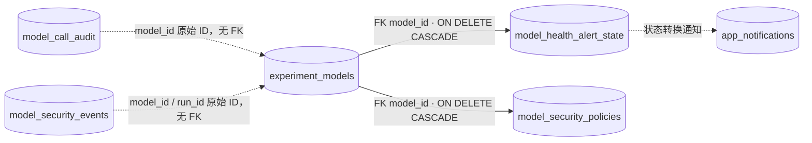

`/model-health` 用最近五分钟 `model_call_audit` 的请求计算 QPS、延迟分位数和 5xx 比例；没有调用记录只能显示“暂无调用”，不能推断提供商在线。`model_health_alert_state` 记录每个模型上次是否异常及转换轮次，模型删除时级联清除；定时检查仅在从正常转为异常时给管理员写入 `app_notifications`，避免每五秒重复通知。通知和状态表之间没有 SQL 外键。

`/model-costs` 经 `/api/model-costs` 读取 `model_cost_ledger`。迁移时把已有 `experiment_runs.cost_usd` 减去 `judge_cost_usd` 归主模型，Judge 部分归 Judge 模型；之后数据库触发器在费用写入时同步两部分。账号取批次 `owner_id`，`dataset`／`regression` 批次归评测模块，其余归实验模块。账本以 `(run_id, part)` 为主键，**故意不对运行、模型、账号设外键**，因此删除原记录后已记账费用仍保留；模型或账号删除后显示原始 ID。旧运行账务时间取完成时间或创建时间，新费用以写入账本的 UTC 时刻记账。运行费用字段与账本金额均使用 12 位小数。

`model_cost_settings` 是 ID 固定为 1 的无外键单行表，保存美元月预算及并发版本。运行批次完成后，服务按 UTC 月累计已记账费用，对 80%／100%／120% 生成按月份去重的管理员通知；今日成本超过前七个完整 UTC 日的平均值三倍时生成按日期去重的异常通知。零预算关闭预算阈值通知，历史运行仍进入报表。

## 保留策略与每日清理记录

`retention_settings` 是单行版本化保留配置，保存独立安全审计保留天数、会话保留天数、核心内容回收天数以及系统时区下的清理时间。`retention_cleanup_runs` 以本地日历日为主键，记录每日清理结果和逐项永久删除失败原因，避免重启后重复执行。清理器删除过期 `security_audit_logs` 与 `sessions`；会话删除级联消息和评分，未审核会话候选同时删除，已审核候选和摘录笔记保留并显示“原会话已清理”。[035_core_recycle_bin.sql](../db/migrations/035_core_recycle_bin.sql) 给 `tasks`、`notes`、`experiments` 增加 `deleted_at`；`prompt_library` 已在旧迁移中有该字段。删除后正常读取过滤已删除行，管理员可恢复或永久删除；到期清理按行设置保存点，关联约束阻止删除时保留条目并记录失败。恢复实验不会恢复已撤销的分享或暂停的调度；恢复任务暂不重建删除时从其他任务移除的依赖边。这两张保留策略表无外键。

本文对应当前的 [建表迁移](../db/migrations/001_initial.sql)、[补充约束迁移](../db/migrations/002_constraints.sql)及后续版本化迁移，最新为 [057_project_suggestion_priorities.sql](../db/migrations/057_project_suggestion_priorities.sql)。当前共 **108 张表**。关系图中的**实线是数据库外键**，**虚线是应用代码使用的 ID 关联，没有数据库外键**；第一张图展示请求流向，箭头不代表外键。表中提到的页面路径以当前 [路由配置](../src/App.tsx) 为准。

## 项目分析连接

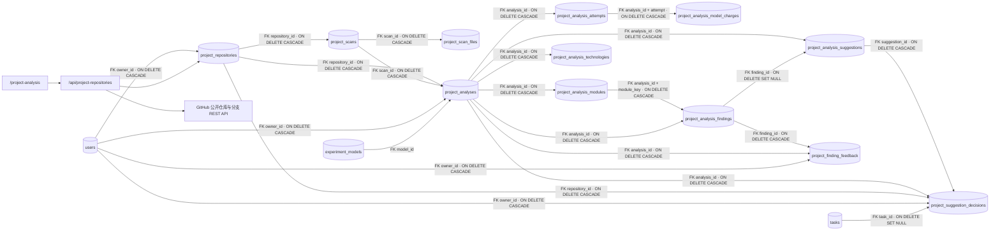

`project_repositories` 保存公开仓库规范名称、分支、项目目标、需求基线文字、最近读取的 commit SHA 和读取时间；`owner_id` 是管理端账号外键，删除账号时级联清除连接。唯一索引限制同一账号重复接入同一仓库分支。列表与详情都按当前账号过滤，猜测 UUID 不会读到其他账号的连接。`last_checked_at` 表示读取分支的时间，不代表完成分析的时间。

`project_scans` 固定创建时的仓库名称、分支与 commit，记录排队、扫描中、完整、部分或失败状态及各类覆盖计数。进行中的相同仓库／commit 扫描由唯一索引合并；服务重启后排队或扫描中的作业重新运行。`project_scan_files` 以扫描 ID 与路径为复合主键，保存文件 Git SHA、大小、分类、读取状态、内容哈希及成功读取的 UTF-8 正文；非读取成功的记录由 CHECK 约束禁止保存正文。列表只返回索引字段，正文读取接口先验证当前账号拥有仓库连接。迁移前的旧扫描正文为空，需要重新扫描。

`project_analyses` 兼作后台任务和已完成报告的固定头部，保存账号、仓库、扫描、模型的外键，以及提交时冻结的仓库名称、分支、commit、目标、需求基线、供应商／模型和单价。相同扫描与模型的进行中任务由部分唯一索引合并；启动后排队或分析中的任务会重新处理。`attempts` 记录已发起的调用尝试，默认最多三次；`project_analysis_attempts` 以分析 ID＋次数为复合主键，外键指向主任务并级联删除，保存每次预算预估及累计用量。`project_analysis_model_charges` 逐次保存模块模型调用的 token、费用和入账时间，并以分析 ID＋次数外键关联尝试；迁移时旧尝试的已知费用保留为单条调用。活跃预留持续占用当日预算，实际费用按每次调用的入账日统计。`project_analysis_modules` 以分析 ID＋目录模块名为复合主键，保存此次报告的索引、读取、入选、截断、排除、失败和未扫描文件数，以及成功分析的模块摘要；只在整份报告成功事务中写入，不为旧报告伪造历史选择。`project_analysis_technologies` 记录固定扫描中可读 `package.json` 依赖项的已知技术名称、包名、原始文件行与 Git SHA；它只提供依赖声明线索，不证明运行或实际使用。`project_analysis_findings` 的可空 `module_key` 与分析 ID 一起引用模块，旧结论保持空值。`project_finding_feedback` 逐条记录账号对结论状态的人工校正及理由，不改写模型判断与代码证据；报告按时间倒序展示全部记录。`project_suggestion_decisions` 以建议 ID 为主键，保存账号对建议的接受／忽略决定；接受时在同一事务创建现有 `tasks` 行，数据库的部分唯一索引阻止同账号同仓库归一化文字指纹重复接受。任务被永久删除后 `task_id` 置空；删除报告或仓库时决定记录级联删除，已创建任务仍保留，任务正文包含当时的实践、验收及来源链接。`canceled_at` 记录取消时间；取消时中断运行中请求，迟到结果不得写成成功报告。`project_analysis_findings` 逐条保存状态、说明和文件行证据；`project_analysis_suggestions` 保存实践任务与验收要求，可用外键指向关联结论，删除结论时置空。新报告还保存模型估计的影响等级、影响下一步开发的理由和前置知识数组；旧报告这些新增字段为空，不反推模型当时未给出的判断。子表随分析删除级联。分析结果在一个事务中写入；只有每个模块 JSON 结构及路径／行号／原文证据校验通过才置为已完成。当前模型调用由 API 进程内队列执行，跨进程崩溃时外部模型调用仍可能重复计费；已经发出的请求取消后也可能由供应商计费。

## 页面如何读写数据

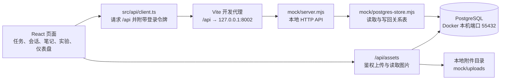

`mock` 是历史目录名，`mock/server.mjs` 现在提供实际的本地 HTTP 接口。`npm run dev` 同时启动它和 Vite。请求在同一个 PostgreSQL 事务中读取关系表为内存工作集，执行现有任务与会话规则，再把变化写回；批量操作、CSV 导入及重复任务生成也沿用事务。页面并不直接连接数据库，旧 `mock/db.json` 仅供显式一次性导入。该实现面向本地开发，尚未把每个列表和聚合改写成定向 SQL 查询，也不是生产部署服务。

## 任务、重复任务与模板

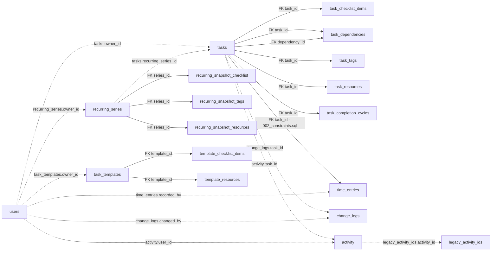

`task_dependencies` 的 `task_id` 与 `dependency_id` **分别**引用 `tasks.id`，因此图中有两条实线。`time_entries.task_id` 的外键由 [第二个迁移](../db/migrations/002_constraints.sql) 增加。`change_logs` 和 `activity` 为保留历史原始 ID，图中的任务／操作者连线只是逻辑关联；`activity` 也记录笔记和实验事件，并非只有任务事件。`legacy_activity_ids` 保存旧活动的 ID，同样没有外键。重复任务的实例通过 `tasks.recurring_series_id` 和 `recurrence_index` 指向序列；数据库为两者组合设置唯一索引，但 `recurring_series_id` 目前没有外键。删除某次任务不会自动删除或停止序列。

| 表 | 当前内容与关键关系 | 对应页面或功能 |
| --- | --- | --- |
| `tasks` | 任务实例；含状态、进度、日期、归属、版本、重复序列 ID 和次数。`owner_id` 是逻辑关联。 | `/tasks`、`/tasks/:id`、仪表盘 |
| `task_checklist_items` | 任务清单项；`task_id` 外键，删除任务时级联删除。 | 任务详情、模板创建 |
| `task_dependencies` | 每行表示一个“任务 → 前置任务”；两个任务 ID 都有外键，任一端删除时该关系被删除。 | 任务详情、看板阻塞状态、甘特图 |
| `task_tags` | 任务标签；`task_id` 外键，支持多标签筛选。 | 任务列表、详情、看板 |
| `task_resources` | 任务资源链接；`task_id` 外键。 | 任务详情 |
| `task_completion_cycles` | 每次完成／重开周期；`task_id` 外键。 | 任务详情的历时信息 |
| `time_entries` | 手动工时段与时长；`task_id` 外键由 `002_constraints.sql` 添加，`recorded_by` 仅保存账号 ID。 | 任务详情、仪表盘工时偏差 |
| `change_logs` | 任务字段变更和回滚历史；`task_id`、`changed_by` 为逻辑关联，旧值和新值为 JSONB。 | 任务详情“历史记录” |
| `recurring_series` | 频率、截止条件、下一次序号和后续任务的字段快照；任务／账号 ID 为逻辑关联。 | 任务编辑、重复实例生成 |
| `recurring_snapshot_checklist` | 后续实例使用的清单文字；`series_id` 外键。 | 重复实例生成 |
| `recurring_snapshot_tags` | 后续实例使用的标签；`series_id` 外键。 | 重复实例生成 |
| `recurring_snapshot_resources` | 后续实例使用的资源；`series_id` 外键。 | 重复实例生成 |
| `task_templates` | 用户保存的任务模板；`owner_id` 为逻辑关联。 | 创建任务时选择模板 |
| `template_checklist_items` | 模板清单；`template_id` 外键。 | 从模板创建任务 |
| `template_resources` | 模板建议资源；`template_id` 外键。 | 从模板创建任务 |

## 实验定义与执行基础

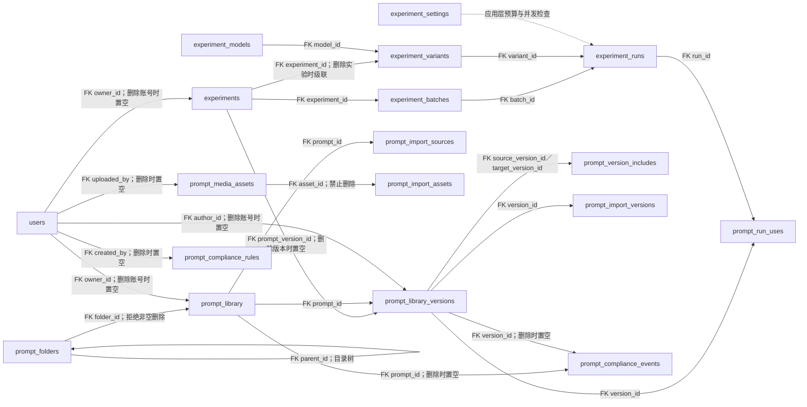

`experiments.record_kind` 区分未迁移内容的 `manual` 与可执行的 `definition`。旧手工记录保留原文、自评分和时间，缺少可靠创建者时只有管理员可管理。新定义的 `owner_id` 是真实账号外键；`task_id` 仍仅是逻辑关联。变体更新会停用旧变体并新建变体，旧运行继续引用原变体。运行保存请求时使用的提示词、参数、模型 API 名称、输入／输出单价快照及最终 token／延迟／成本，防止之后修改配置改写历史。运行队列依靠数据库状态在服务重启后恢复；模型密钥只在服务端环境变量中。

| 表 | 当前内容与关键关系 | 对应页面或功能 |
| --- | --- | --- |
| `experiment_settings` | 单行每日预算、并发上限和预留的 Judge 模型 ID。 | 实验管理员配置 |
| `experiment_models` | 唯一名称、供应商、能力、状态、角色白名单和美元／百万 token 内部单价；可绑定加密连接。 | 实验变体选择、成本快照、治理目录 |
| `prompt_library` | 提示词条目、标签、文件夹及软删除标记；创建者与文件夹为外键。 | `/prompts`、实验表单提示词来源 |
| `prompt_library_versions` | 不可变版本快照；旧整数版映射为 `0.0.N`，正文、类型、变量、消息结构和作者随版本保存。`prompt_id` 外键。 | `/prompts/:id`、实验定义选择固定版本 |
| `prompt_version_includes` | 固定版本间的直接引用边；源和目标版本均有外键。保存时检查引用链的循环与变量定义冲突。 | 提示词详情双向引用、运行时展开 |
| `prompt_run_uses` | 每次实验运行对直接及间接引用版本的归因事实；运行和版本均有外键，失败运行亦保留。 | 提示词版本统计、热度分析 |
| `prompt_import_sources` | 外部来源键和来源条目 ID 到本地提示词 ID 的稳定映射；重复导入避免复制。 | JSON/YAML 导入 |
| `prompt_import_versions` | 来源版本 ID 到本地不可变版本的映射；保持固定版本引用可重映射。 | JSON/YAML 版本导入 |
| `prompt_media_assets` | 本地受控图片、音频、视频附件元数据；上传账号有可置空外键，消息块中的附件 ID 由应用层校验。 | 提示词消息片段与实验运行 |
| `prompt_import_assets` | ZIP 来源键和附件 ID 映射到本地媒体，保存来源 SHA-256；同来源重复回导时复用附件，哈希变化则拒绝。`asset_id` 为外键。 | 提示词媒体 ZIP 回导 |
| `prompt_folders` | 可无限嵌套的共享目录；`parent_id` 自引用外键，非空目录不能删除。 | 提示词库侧栏 |
| `prompt_compliance_rules` | 管理员配置的受限自定义敏感信息模式。 | 提示词库合规管理 |
| `prompt_compliance_events` | 被拦截或明确确认后的扫描审计；提示词、版本与账号外键可置空。 | 提示词保存审计 |

LangFuse／LangSmith 的手动只读同步沿用 `prompt_import_sources` 和 `prompt_import_versions` 的来源映射及提示词合规扫描，不新建外部数据表。服务端凭据来自环境变量；复杂消息和无法无损映射的媒体版本会在预览中列为跳过，不落入数据库。
| `experiment_variants` | 一个实验定义的模型和参数组合；实验与模型均为外键。 | 实验详情、批量运行 |
| `experiment_batches` | 单次或 A/B 批次、变量输入、运行状态；实验和发起账号均为外键。 | 运行进度与汇总 |
| `experiment_runs` | 每个变体和输入组的独立执行、状态、响应、用量、主模型及 Judge 媒体价格快照；批次、实验和变体均为外键。 | 实验详情的运行结果 |

## 实验评测、标注、分享与调度

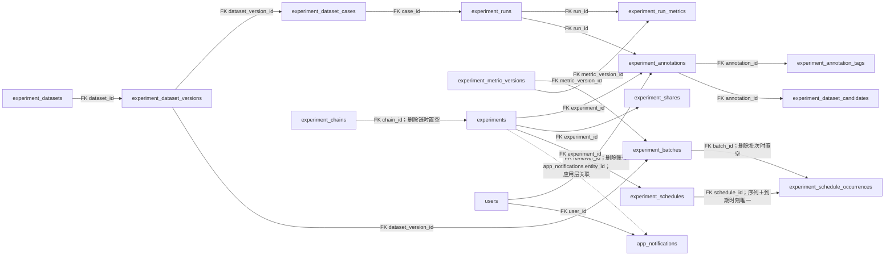

数据集版本固定用例清单，运行通过 `case_id` 记录对应输入。指标版本确定规则评分、Judge 提示词、通过门槛及退化阈值；规则和 Judge 的 0–5 分独立保存，再计算合成分。人工评分与自动分分开存储，人工标签只允许迁移中列出的七种值；标注可进入待审核候选池，不自动改写已发布数据集。版本链只在用户确认相似标题建议后设置稳定 `chain_id`。

分享表只保存随机令牌的哈希，公开页使用令牌查找最新配置和运行结果，过期或撤销后无法访问。调度记录以 `(schedule_id, due_at)` 唯一约束防止同一周期重复执行；账号时区用于计算下次运行时刻。`app_notifications.entity_id` 是应用层多类型关联，没有指向实验或调度的 SQL 外键；笔记复习仍保留原有专用通知表。

| 表 | 当前内容与关键关系 | 对应页面或功能 |
| --- | --- | --- |
| `experiment_metric_versions` | 规则类型、Judge 提示词、通过与退化门槛；由批次和运行指标引用。 | 回归设置与报告 |
| `experiment_datasets` | 数据集目录；创建账号外键可置空。 | `/experiments/datasets` |
| `experiment_dataset_versions` | 不可变的版本标识；`dataset_id` 外键。 | 数据集版本选择 |
| `experiment_dataset_cases` | 稳定用例键、变量、参考答案、难度与分类；版本外键。 | 回归逐项比较 |
| `experiment_run_metrics` | 单次运行的规则、Judge 和合成评分；运行与指标版本外键。 | 回归报告、自动评分 |
| `experiment_annotations` | 人工星级；实验、具体运行和评分账号外键，账号删除后匿名保留。 | 实验输出评分 |
| `experiment_annotation_tags` | 人工标签；标注外键和七值 CHECK。 | 实验输出标签 |
| `experiment_dataset_candidates` | 标注衍生的待审核候选；实验、运行、标注均为外键。 | 数据集候选池 |
| `experiment_chains` | 用户确认后的稳定版本链；创建账号外键。 | `/experiments/chains/:id` |
| `experiment_shares` | 只读分享的令牌哈希、期限、撤销时间；实验与创建者外键。 | `/share/experiments/:token` |
| `experiment_schedules` | 时区、频率、变量、重试、连续失败次数和下次执行时间；实验与账号外键。 | `/experiments/schedules` |
| `experiment_schedule_occurrences` | 每个计划周期与批次的持久关联；调度与批次外键。 | 定时运行恢复及去重 |
| `app_notifications` | 实验事件站内通知及可选邮件发送状态；账号外键。 | 顶部铃铛 |

## 评测数据集增量关系（019–020）

[019_evaluation_datasets.sql](../db/migrations/019_evaluation_datasets.sql) 新增文件夹、用例媒体引用，并扩展旧实验数据集；[020_evaluation_metrics.sql](../db/migrations/020_evaluation_metrics.sql) 扩展指标规则、分词版本和固定目标范围。图中实线均为 SQL 外键。

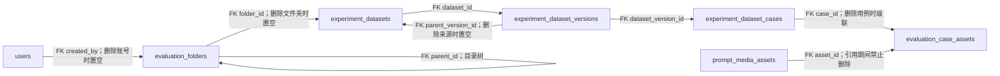

| 表 | 当前内容与关键关系 | 对应页面或功能 |
| --- | --- | --- |
| `evaluation_folders` | 无限层级目录；`parent_id` 自引用，非空目录不能删除。 | `/experiments/datasets` 文件夹浏览 |
| `evaluation_case_assets` | 用例与媒体附件的去重关联；两个 ID 都有外键，附件被引用时不能删除。 | 多模态用例保存、媒体配额核算 |

`experiment_dataset_cases` 现在还保存结构化输入、可选结构化参考答案、上下文、标签、1–5 难度、来源及期望工具调用。旧 `variables` 和 `reference_answer` 保留供已有实验运行读取。数据集子集保留创建时的固定 `parent_version_id`，来源版本的后续编辑不会改变子集。文件夹移动只更新目录元数据；用例内容修改必须新增版本。

## 自动运行、人工评测与退化告警（021–023）

[021_evaluation_run_details.sql](../db/migrations/021_evaluation_run_details.sql) 给运行指标增加逐项得分详情和重试上限；[022_evaluation_alerts.sql](../db/migrations/022_evaluation_alerts.sql) 保存退化告警；[023_evaluation_human_reviews.sql](../db/migrations/023_evaluation_human_reviews.sql) 保存双盲任务、分配和评分。

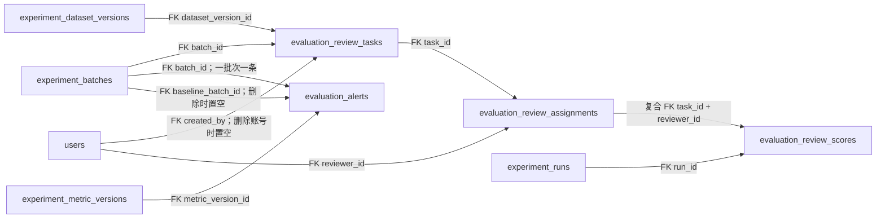

| 表 | 当前内容与关键关系 | 对应页面或功能 |
| --- | --- | --- |
| `evaluation_review_tasks` | 固定评测批次、数据集版本和四维评分标准；批次删除时级联。 | `/evaluation/reviews` |
| `evaluation_review_assignments` | 两位主评测员及争议后指派的仲裁员；任务和账号外键。 | 双盲待评队列 |
| `evaluation_review_scores` | 每账号每运行一份不可重复的四维 0–10 分；复合分配外键和运行外键。 | 一致性报告、争议仲裁 |
| `evaluation_alerts` | 单个回归批次的持久退化记录；关联固定 baseline 与指标版本。 | 退化告警和站内通知 |

`experiment_run_metrics.metric_details` 保存各内置指标的归一化得分、延迟与输出 token；`experiment_runs.retry_limit` 保存重试上限。跨版本比较使用 `case_key` 与输入、变量、上下文的指纹，数据库行 ID 只标识一个版本中的实例。双盲四维评分与实验输出的 1–5 星标注是不同数据，不能互相覆盖。

## 反馈候选与数据集发布（024–025）

[024_evaluation_candidates.sql](../db/migrations/024_evaluation_candidates.sql) 增加统一的会话／实验候选池；[025_evaluation_candidate_backfill.sql](../db/migrations/025_evaluation_candidate_backfill.sql) 将旧的 4–5 星标注补入候选池。候选来源标注 ID 因跨两种表而由应用层维护，图中虚线不是外键。

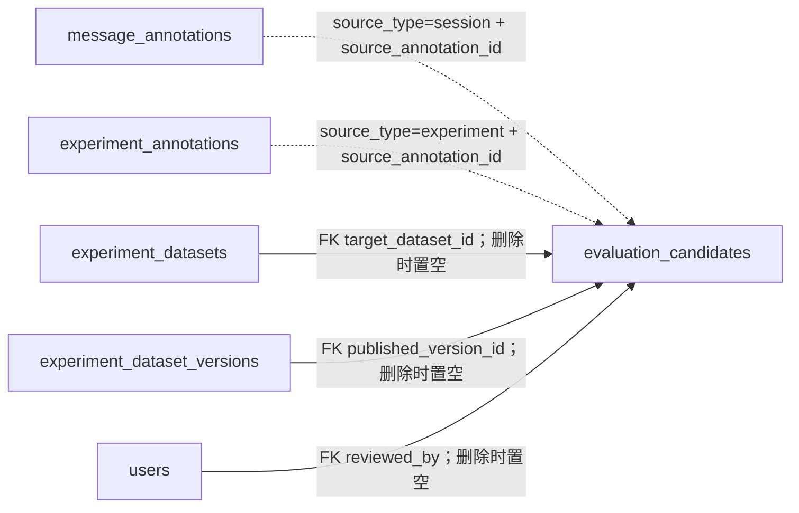

| 表 | 当前内容与关键关系 | 对应页面或功能 |
| --- | --- | --- |
| `evaluation_candidates` | 高分反馈的原始输入、输出、上下文、星级与审核状态；发布时指向目标数据集和新版本。 | `/evaluation/candidates` |

候选审核通过只进入暂存区，管理员的第二次操作将同一目标数据集的暂存条目批量追加到最新版本。原来的 `experiment_dataset_candidates` 仍保留供实验详情兼容读取；新的统一候选池同时收集会话反馈。

## 模型排行与定时评测（026–027）

[026_evaluation_metric_goals.sql](../db/migrations/026_evaluation_metric_goals.sql) 为指标版本保存固定目标区间。排行榜仅比较相同数据集版本与指标版本的已完成运行，按预设方向和区间归一化准确性、延迟和输出 token，再应用页面权重；不会依赖本次候选模型的最大最小值。[027_evaluation_schedules.sql](../db/migrations/027_evaluation_schedules.sql) 将计划和每次应执行的周期分开保存。

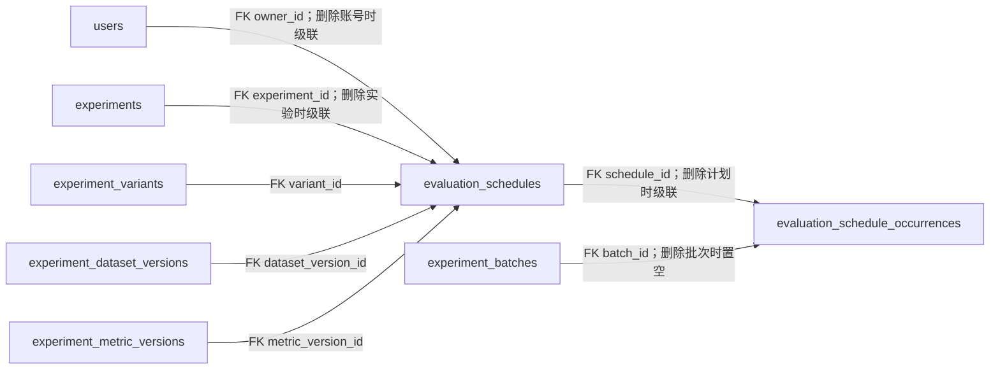

| 表 | 当前内容与关键关系 | 对应页面或功能 |
| --- | --- | --- |
| `evaluation_schedules` | 账号时区、每日／每周频率、固定数据集和指标版本、模型变体、下一执行时间；到期时行锁认领。 | `/evaluation/schedules` 创建、暂停、恢复、删除 |
| `evaluation_schedule_occurrences` | 每个计划时间唯一一条，记录批次与执行状态；重启补建时避免同周期重复提交。 | 立即执行、补建和失败通知 |

调度到期通过已有实验批次执行服务创建评测运行，逐项结果仍保存在 `experiment_runs` 和 `experiment_run_metrics`；通知保存在 `app_notifications`。删除计划会级联删除周期记录，已产生的批次和运行结果仍保留。排行榜页面为 `/evaluation/leaderboard`。

## 评测报告只读分享（028）

[028_evaluation_report_shares.sql](../db/migrations/028_evaluation_report_shares.sql) 增加一张报告分享表。分享链接只保存 SHA-256 令牌哈希、可选到期时间和撤销时间；创建人删除时置空，报告批次删除时级联。分享固定 `batch_id`，因此同批次的重试和结果更新反映在原链接，不会转到另一个批次。

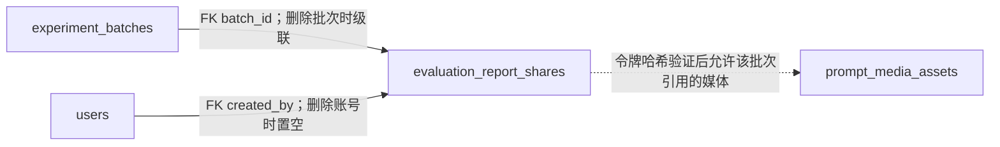

| 表 | 当前内容与关键关系 | 对应页面或功能 |
| --- | --- | --- |
| `evaluation_report_shares` | 固定报告批次、令牌哈希、期限和撤销状态；媒体权限通过运行用例与输出引用在应用层核查。 | `/experiments/reports/:id` 分享弹窗、`/share/evaluation-reports/:token` 公开页 |

## 评测媒体配额（029）

[029_evaluation_settings.sql](../db/migrations/029_evaluation_settings.sql) 新增单行配置表 `evaluation_settings`，默认全局 10 GB、单数据集 5 GB，要求磁盘至少保留 20% 空间；管理员可在数据集页面调整。该表没有外键。保存新版本前，API 会按附件去重计算占用，并核查引用权限：管理员可引用所有附件，普通成员只能引用自己上传的附件。版本和媒体引用仍由 `evaluation_case_assets` 保持外键约束。

## 隔离 Python 指标（030）

[030_evaluation_python_metrics.sql](../db/migrations/030_evaluation_python_metrics.sql) 新增 `evaluation_metric_scripts`，以稳定 ID 保存管理员登记的不可变 Python 源码，并由指标版本的 `custom_script_id` 外键固定引用；数据库约束要求 `custom_python` 规则必须引用脚本，其他规则不能引用。BERTScore 继续作为独立规则类型，运行时须有已构建的专用容器镜像。

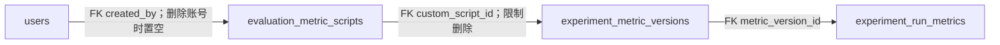

| 表 | 当前内容与关键关系 | 对应页面或功能 |
| --- | --- | --- |
| `evaluation_metric_scripts` | 不可变源码和创建人；指标版本通过外键固定脚本，运行结果保存在 `experiment_run_metrics.metric_details`。 | `/evaluation/metrics` 管理员登记和选择 |

## 逐指标退化阈值（031）

[031_evaluation_normalized_regression.sql](../db/migrations/031_evaluation_normalized_regression.sql) 给 `experiment_metric_versions` 增加固定的 `normalized_regression_threshold`，默认 0.2；没有新增表或外键。回归批次完成时按稳定 `case_key` 和输入指纹对齐 baseline，再将综合分、延迟、输出 token 与文本／工具指标映射到 0–1。每个超过阈值的指标都记入原有 `evaluation_alerts.details`，受影响用例数按 `caseKey` 去重。管理员从 `/evaluation/alerts` 查看告警、进入固定报告或导出带建议的 CSV；站内通知仍写入 `app_notifications`。

## 账号、会话与人工评分

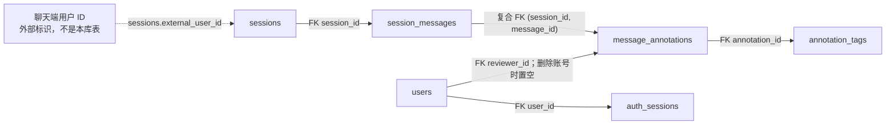

消息 ID 只要求在**同一会话内**唯一；`session_messages` 的主键为 `(session_id, id)`。评分表用 `(session_id, message_id)` 复合外键引用这两个字段。同一管理端账号对同一消息的有效评分由唯一索引限制为一条；删除评分账号时 `reviewer_id` 置空，原评分仍参与汇总。`annotation_tags.tag` 另有 [CHECK 约束](../db/migrations/002_constraints.sql)，只允许“准确、不准确、偏题、幻觉、过于冗长、过于简略、格式错误”七种标签。删除会话会级联删除消息、评分及其标签。`sessions.external_user_id` 不引用 `users.id`，不能把聊天端用户当成管理端评分账号。

| 表 | 当前内容与关键关系 | 对应页面或功能 |
| --- | --- | --- |
| `users` | 管理端账号、密码哈希、角色、启用状态及个人复习邮件设置。 | `/login`、`/accounts`、`/notes/reviews` |
| `auth_sessions` | 登录令牌哈希、到期与撤销时间；`user_id` 外键，删除账号时级联删除。 | 登录、退出、HTTP／WebSocket 鉴权 |
| `sessions` | 聊天端上报的会话；`external_user_id` 是外部用户标识。 | `/sessions` |
| `session_messages` | 会话中的 user／assistant 消息，保留顺序和首次确定的 ID；`session_id` 外键。 | 会话行内预览 |
| `message_annotations` | assistant 消息的 1–5 星评分；复合消息外键及可置空的评分账号外键。 | 会话消息下的评分和汇总 |
| `annotation_tags` | 一条评分可选的多个标签；`annotation_id` 外键，`tag` 受 `002_constraints.sql` 的七种标签 CHECK 约束。 | 会话消息下的标签人数 |

## 关联内容、活动与迁移元数据

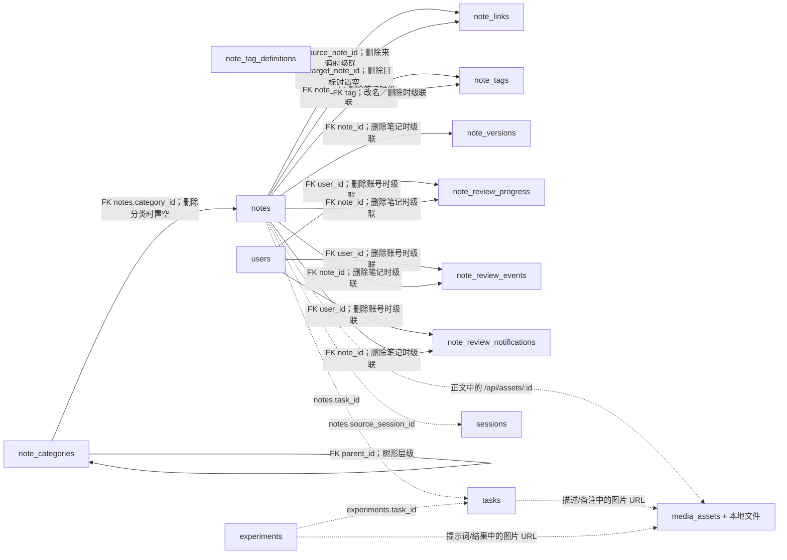

`note_links` 每行是一处正文引用，`source_note_id` 与 `target_note_id` 都有 SQL 外键。目标笔记删除后 `target_note_id` 置空，原引用文字和 `target_ref` 保留，页面显示红色虚线占位。`media_assets` 只存图片元数据，文件由本地 API 保存在 `mock/uploads/`；Markdown 字段里的图片 URL 是应用层引用，没有 SQL 外键。未被当前内容引用且已上传超过 24 小时的图片由服务定时清理。

`note_categories.parent_id` 形成可自定义的分类树，应用层拒绝间接循环；有子分类时不能删除父分类。删除叶子分类会把其笔记的 `category_id` 置空。`note_tag_definitions` 为每个笔记标签保存稳定 ID、显示名称和唯一规范化名称；`note_tags.tag` 通过名称外键引用它，改名和删除会级联到关联表。API 在同一事务中同步笔记标签数组，合并时去重。标签无笔记使用时仍留在目录和输入候选中，标签云只显示使用篇数大于零的标签。`note_tags` 与任务的 `task_tags` 完全分离；笔记列表可按分类及其子树、多个标签和标题／正文关键词组合筛选。

`note_versions` 每次保存标题和正文的完整快照，按 `(note_id, version_number)` 唯一；回滚会追加新版本。迁移前的笔记只生成当前内容的基线版本。知识图谱本身不另建表，`/api/knowledge-graph` 汇总 `notes`、`note_links`、`tasks` 和 `sessions`；笔记到任务和来源会话的关联仍由应用层维护。

下表中的笔记和实验 `task_id`、笔记 `source_session_id` 等字段用于当前页面的关联查询，但**没有 SQL 外键**。因此历史记录可以保留已删除实体的原始 ID；不能仅凭这些字段推断目标记录仍然存在。`note_links` 的两个笔记关联则有 SQL 外键。

| 表 | 当前内容与关键关系 | 对应页面或功能 |
| --- | --- | --- |
| `notes` | 笔记；`task_id`、`source_session_id` 分别记录关联任务和来源会话，均为逻辑关联。 | `/notes`、`/notes/:id`、任务详情“关联” |
| `note_categories` | 笔记分类树；`parent_id` 自引用外键。 | `/notes` 分类侧栏和分类管理 |
| `note_tag_definitions` | 笔记标签目录；稳定 ID、唯一名称及大小写归一键，允许零使用标签。 | `/notes` 标签候选与管理员管理入口 |
| `note_tags` | 笔记独立的多标签；`note_id` 和 `tag` 均有外键。 | `/notes` 标签云与筛选 |
| `note_links` | 笔记正文的双向引用；来源和目标均有外键，目标删除时保留悬空引用。 | `/notes/:id`、`/notes/graph` |
| `note_versions` | 每次保存或回滚产生的标题／正文快照；`note_id` 外键，删除笔记时级联删除。 | `/notes/:id` 历史版本、对比与回滚 |
| `note_review_progress` | 每账号每笔记一行；保存间隔阶段、轮次和到期日，账号与笔记均为级联删除外键。 | `/notes/reviews` |
| `note_review_events` | 每次完成复习的不可重复记录；账号、笔记均为级联删除外键，账号＋笔记＋轮次唯一。 | 复习面板勾选及历史核验 |
| `note_review_notifications` | 到期站内提醒、已读状态和邮件投递状态；账号、笔记均为级联删除外键，账号＋笔记＋轮次唯一。 | 顶部铃铛、邮件重试 |
| `media_assets` | 图片 MIME、大小、上传时间；文件存本地附件目录，内容字段通过 URL 逻辑引用。 | Markdown 编辑器及详情预览 |
| `experiments` | 手工记录或可执行实验定义；`task_id` 为逻辑关联，`owner_id` 与提示词版本为外键。 | `/experiments`、`/experiments/:id`、任务详情“关联” |
| `activity` | 创建、修改、完成等活动摘要；任务和操作者 ID 为逻辑关联。 | 仪表盘最近活动、任务早期活动 |
| `legacy_activity_ids` | 标记从旧 JSON 带来的活动 ID，便于与新字段历史分开展示；无外键。 | 任务详情“早期活动” |
| `task_trend_events` | 任务创建／完成等趋势事件；`task_id` 为逻辑关联。 | 仪表盘趋势折线图 |
| `task_trend_snapshots` | 某时点任务总数与进度总和的快照；无实体外键。 | 仪表盘累计平均进度 |
| `schema_migrations` | 已执行的 SQL 迁移版本与时间。 | `npm run db:migrate` |
| `data_imports` | 旧 JSON 导入文件的哈希与导入时间，防止重复导入。 | `npm run db:import` |

三个表组分别列出 15、6、17 张表，合计 38 张。复习表对账号和笔记使用真实外键；`generation` 是业务轮次，通过唯一约束防止重复提醒或复习记录，不是跨表外键。查看实际定义时以 SQL 迁移文件为准；图解释的是**当前实现**，未来添加外键或改变删除策略时，应同步更新本文。
