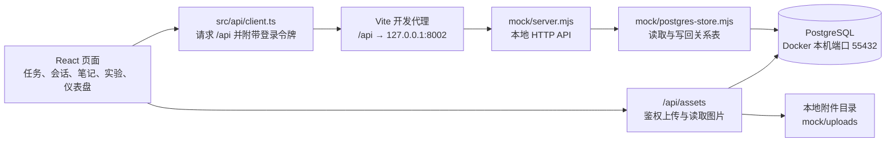
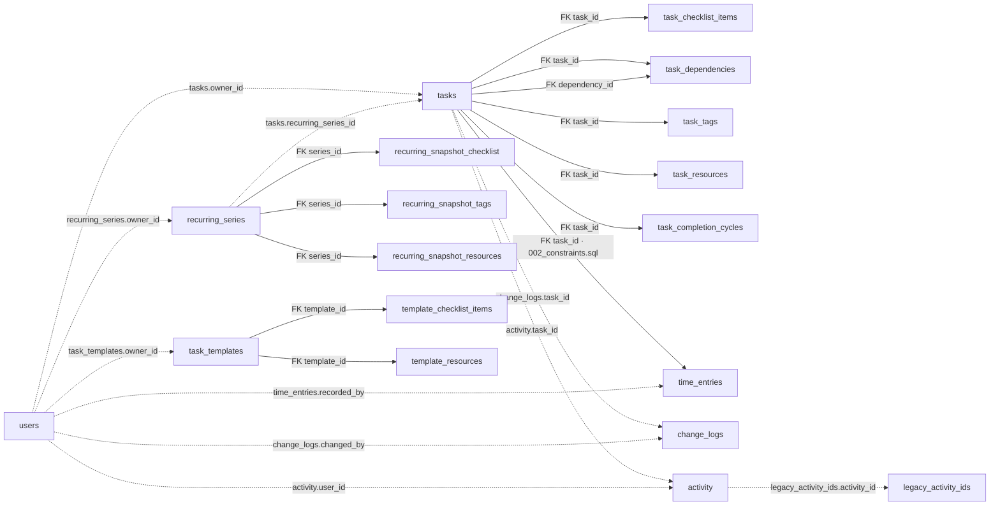
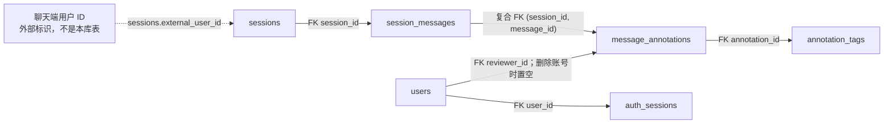
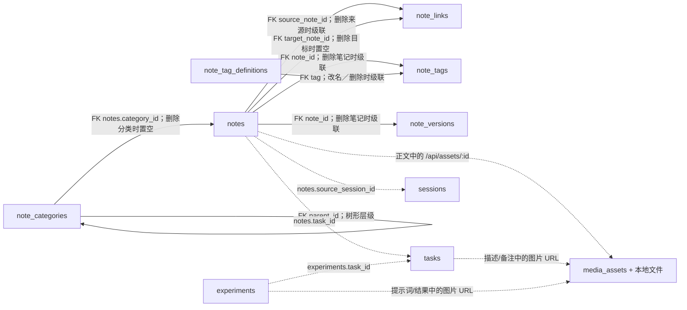

# 当前数据库关系与页面取数

本文对应当前的 [建表迁移](../db/migrations/001_initial.sql)、[补充约束迁移](../db/migrations/002_constraints.sql)、[笔记引用迁移](../db/migrations/003_note_links.sql)、[图片附件迁移](../db/migrations/004_media_assets.sql)、[笔记分类与标签迁移](../db/migrations/005_note_taxonomy.sql)、[笔记标签目录迁移](../db/migrations/006_note_tag_catalog.sql)和[笔记版本迁移](../db/migrations/007_note_versions.sql)，描述本地 API 已实现的 PostgreSQL 结构。共 **35 张表**。关系图中的**实线是数据库外键**，**虚线是应用代码使用的 ID 关联，没有数据库外键**；第一张图展示请求流向，箭头不代表外键。表中提到的页面路径以当前 [路由配置](../src/App.tsx) 为准。

## 页面如何读写数据

`mock` 是历史目录名，`mock/server.mjs` 现在提供实际的本地 HTTP 接口。`npm run dev` 同时启动它和 Vite。请求在同一个 PostgreSQL 事务中读取关系表为内存工作集，执行现有任务与会话规则，再把变化写回；批量操作、CSV 导入及重复任务生成也沿用事务。页面并不直接连接数据库，旧 `mock/db.json` 仅供显式一次性导入。该实现面向本地开发，尚未把每个列表和聚合改写成定向 SQL 查询，也不是生产部署服务。

## 任务、重复任务与模板

`task_dependencies` 的 `task_id` 与 `dependency_id` **分别**引用 `tasks.id`，因此图中有两条实线。`time_entries.task_id` 的外键由 [第二个迁移](../db/migrations/002_constraints.sql) 增加。`change_logs` 和 `activity` 为保留历史原始 ID，图中的任务／操作者连线只是逻辑关联；`activity` 也记录笔记和实验事件，并非只有任务事件。`legacy_activity_ids` 保存旧活动的 ID，同样没有外键。重复任务的实例通过 `tasks.recurring_series_id` 和 `recurrence_index` 指向序列；数据库为两者组合设置唯一索引，但 `recurring_series_id` 目前没有外键。删除某次任务不会自动删除或停止序列。

| 表 | 当前内容与关键关系 | 对应页面或功能 |
| --- | --- | --- |
| `tasks` | 任务实例；含状态、进度、日期、归属、版本、重复序列 ID 和次数。`owner_id` 是逻辑关联。 | `/tasks`、`/tasks/:id`、仪表盘 |
| `task_checklist_items` | 任务清单项；`task_id` 外键，删除任务时级联删除。 | 任务详情、模板创建 |
| `task_dependencies` | 每行表示一个“任务 → 前置任务”；两个任务 ID 都有外键，任一端删除时该关系被删除。 | 任务详情、看板阻塞状态、甘特图 |
| `task_tags` | 任务标签；`task_id` 外键，支持多标签筛选。 | 任务列表、详情、看板 |
| `task_resources` | 任务资源链接；`task_id` 外键。 | 任务详情 |
| `task_completion_cycles` | 每次完成／重开周期；`task_id` 外键。 | 任务详情的历时信息 |
| `time_entries` | 手动工时段与时长；`task_id` 外键由 `002_constraints.sql` 添加，`recorded_by` 仅保存账号 ID。 | 任务详情、仪表盘工时偏差 |
| `change_logs` | 任务字段变更和回滚历史；`task_id`、`changed_by` 为逻辑关联，旧值和新值为 JSONB。 | 任务详情“历史记录” |
| `recurring_series` | 频率、截止条件、下一次序号和后续任务的字段快照；任务／账号 ID 为逻辑关联。 | 任务编辑、重复实例生成 |
| `recurring_snapshot_checklist` | 后续实例使用的清单文字；`series_id` 外键。 | 重复实例生成 |
| `recurring_snapshot_tags` | 后续实例使用的标签；`series_id` 外键。 | 重复实例生成 |
| `recurring_snapshot_resources` | 后续实例使用的资源；`series_id` 外键。 | 重复实例生成 |
| `task_templates` | 用户保存的任务模板；`owner_id` 为逻辑关联。 | 创建任务时选择模板 |
| `template_checklist_items` | 模板清单；`template_id` 外键。 | 从模板创建任务 |
| `template_resources` | 模板建议资源；`template_id` 外键。 | 从模板创建任务 |

## 账号、会话与人工评分

消息 ID 只要求在**同一会话内**唯一；`session_messages` 的主键为 `(session_id, id)`。评分表用 `(session_id, message_id)` 复合外键引用这两个字段。同一管理端账号对同一消息的有效评分由唯一索引限制为一条；删除评分账号时 `reviewer_id` 置空，原评分仍参与汇总。`annotation_tags.tag` 另有 [CHECK 约束](../db/migrations/002_constraints.sql)，只允许“准确、不准确、偏题、幻觉、过于冗长、过于简略、格式错误”七种标签。删除会话会级联删除消息、评分及其标签。`sessions.external_user_id` 不引用 `users.id`，不能把聊天端用户当成管理端评分账号。

| 表 | 当前内容与关键关系 | 对应页面或功能 |
| --- | --- | --- |
| `users` | 管理端账号、密码哈希、角色和启用状态。 | `/login`、`/accounts` |
| `auth_sessions` | 登录令牌哈希、到期与撤销时间；`user_id` 外键，删除账号时级联删除。 | 登录、退出、HTTP／WebSocket 鉴权 |
| `sessions` | 聊天端上报的会话；`external_user_id` 是外部用户标识。 | `/sessions` |
| `session_messages` | 会话中的 user／assistant 消息，保留顺序和首次确定的 ID；`session_id` 外键。 | 会话行内预览 |
| `message_annotations` | assistant 消息的 1–5 星评分；复合消息外键及可置空的评分账号外键。 | 会话消息下的评分和汇总 |
| `annotation_tags` | 一条评分可选的多个标签；`annotation_id` 外键，`tag` 受 `002_constraints.sql` 的七种标签 CHECK 约束。 | 会话消息下的标签人数 |

## 关联内容、活动与迁移元数据

`note_links` 每行是一处正文引用，`source_note_id` 与 `target_note_id` 都有 SQL 外键。目标笔记删除后 `target_note_id` 置空，原引用文字和 `target_ref` 保留，页面显示红色虚线占位。`media_assets` 只存图片元数据，文件由本地 API 保存在 `mock/uploads/`；Markdown 字段里的图片 URL 是应用层引用，没有 SQL 外键。未被当前内容引用且已上传超过 24 小时的图片由服务定时清理。

`note_categories.parent_id` 形成可自定义的分类树，应用层拒绝间接循环；有子分类时不能删除父分类。删除叶子分类会把其笔记的 `category_id` 置空。`note_tag_definitions` 为每个笔记标签保存稳定 ID、显示名称和唯一规范化名称；`note_tags.tag` 通过名称外键引用它，改名和删除会级联到关联表。API 在同一事务中同步笔记标签数组，合并时去重。标签无笔记使用时仍留在目录和输入候选中，标签云只显示使用篇数大于零的标签。`note_tags` 与任务的 `task_tags` 完全分离；笔记列表可按分类及其子树、多个标签和标题／正文关键词组合筛选。

`note_versions` 每次保存标题和正文的完整快照，按 `(note_id, version_number)` 唯一；回滚会追加新版本。迁移前的笔记只生成当前内容的基线版本。知识图谱本身不另建表，`/api/knowledge-graph` 汇总 `notes`、`note_links`、`tasks` 和 `sessions`；笔记到任务和来源会话的关联仍由应用层维护。

下表中的笔记和实验 `task_id`、笔记 `source_session_id` 等字段用于当前页面的关联查询，但**没有 SQL 外键**。因此历史记录可以保留已删除实体的原始 ID；不能仅凭这些字段推断目标记录仍然存在。`note_links` 的两个笔记关联则有 SQL 外键。

| 表 | 当前内容与关键关系 | 对应页面或功能 |
| --- | --- | --- |
| `notes` | 笔记；`task_id`、`source_session_id` 分别记录关联任务和来源会话，均为逻辑关联。 | `/notes`、`/notes/:id`、任务详情“关联” |
| `note_categories` | 笔记分类树；`parent_id` 自引用外键。 | `/notes` 分类侧栏和分类管理 |
| `note_tag_definitions` | 笔记标签目录；稳定 ID、唯一名称及大小写归一键，允许零使用标签。 | `/notes` 标签候选与管理员管理入口 |
| `note_tags` | 笔记独立的多标签；`note_id` 和 `tag` 均有外键。 | `/notes` 标签云与筛选 |
| `note_links` | 笔记正文的双向引用；来源和目标均有外键，目标删除时保留悬空引用。 | `/notes/:id`、`/notes/graph` |
| `note_versions` | 每次保存或回滚产生的标题／正文快照；`note_id` 外键，删除笔记时级联删除。 | `/notes/:id` 历史版本、对比与回滚 |
| `media_assets` | 图片 MIME、大小、上传时间；文件存本地附件目录，内容字段通过 URL 逻辑引用。 | Markdown 编辑器及详情预览 |
| `experiments` | 实验记录；`task_id` 为逻辑关联。 | `/experiments`、`/experiments/:id`、任务详情“关联” |
| `activity` | 创建、修改、完成等活动摘要；任务和操作者 ID 为逻辑关联。 | 仪表盘最近活动、任务早期活动 |
| `legacy_activity_ids` | 标记从旧 JSON 带来的活动 ID，便于与新字段历史分开展示；无外键。 | 任务详情“早期活动” |
| `task_trend_events` | 任务创建／完成等趋势事件；`task_id` 为逻辑关联。 | 仪表盘趋势折线图 |
| `task_trend_snapshots` | 某时点任务总数与进度总和的快照；无实体外键。 | 仪表盘累计平均进度 |
| `schema_migrations` | 已执行的 SQL 迁移版本与时间。 | `npm run db:migrate` |
| `data_imports` | 旧 JSON 导入文件的哈希与导入时间，防止重复导入。 | `npm run db:import` |

三个表组分别列出 15、6、14 张表，合计 35 张。查看实际定义时以 SQL 迁移文件为准；图解释的是**当前实现**，未来添加外键或改变删除策略时，应同步更新本文。
