# 当前数据库关系与页面取数

本文对应当前的 [建表迁移](../db/migrations/001_initial.sql)、[补充约束迁移](../db/migrations/002_constraints.sql)、[笔记引用迁移](../db/migrations/003_note_links.sql)、[图片附件迁移](../db/migrations/004_media_assets.sql)、[笔记分类与标签迁移](../db/migrations/005_note_taxonomy.sql)、[笔记标签目录迁移](../db/migrations/006_note_tag_catalog.sql)、[笔记版本迁移](../db/migrations/007_note_versions.sql)、[复习提醒迁移](../db/migrations/008_note_reviews.sql)、[实验执行基础迁移](../db/migrations/009_experiment_foundation.sql)、[实验评测迁移](../db/migrations/010_experiment_evaluation.sql)、[分享与调度迁移](../db/migrations/011_experiment_sharing_schedules.sql)、[数据集批次约束迁移](../db/migrations/012_experiment_dataset_batch_kind.sql)、[提示词库迁移](../db/migrations/013_prompt_library.sql)、[提示词引用与调用迁移](../db/migrations/014_prompt_references_usage.sql)、[提示词导入来源迁移](../db/migrations/015_prompt_import_sources.sql)、[提示词媒体迁移](../db/migrations/016_prompt_multimodal.sql)、[提示词归档迁移](../db/migrations/017_prompt_archive.sql)和[媒体评分价格快照迁移](../db/migrations/018_media_judge.sql)，描述本地 API 已实现的 PostgreSQL 结构。当前共 **77 张表**，其中 [027_evaluation_schedules.sql](../db/migrations/027_evaluation_schedules.sql) 增加两张；[026_evaluation_metric_goals.sql](../db/migrations/026_evaluation_metric_goals.sql) 只扩展指标版本字段。关系图中的**实线是数据库外键**，**虚线是应用代码使用的 ID 关联，没有数据库外键**；第一张图展示请求流向，箭头不代表外键。表中提到的页面路径以当前 [路由配置](../src/App.tsx) 为准。

## 页面如何读写数据

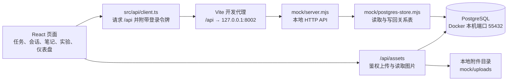

`mock` 是历史目录名，`mock/server.mjs` 现在提供实际的本地 HTTP 接口。`npm run dev` 同时启动它和 Vite。请求在同一个 PostgreSQL 事务中读取关系表为内存工作集，执行现有任务与会话规则，再把变化写回；批量操作、CSV 导入及重复任务生成也沿用事务。页面并不直接连接数据库，旧 `mock/db.json` 仅供显式一次性导入。该实现面向本地开发，尚未把每个列表和聚合改写成定向 SQL 查询，也不是生产部署服务。

## 任务、重复任务与模板

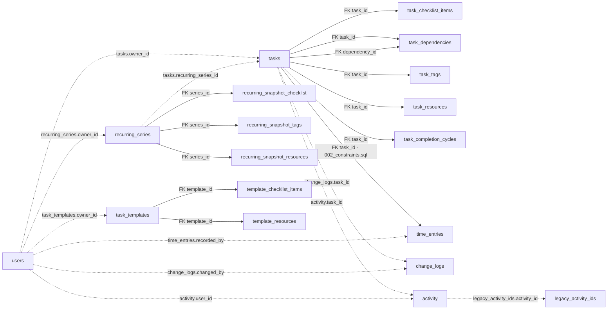

`task_dependencies` 的 `task_id` 与 `dependency_id` **分别**引用 `tasks.id`，因此图中有两条实线。`time_entries.task_id` 的外键由 [第二个迁移](../db/migrations/002_constraints.sql) 增加。`change_logs` 和 `activity` 为保留历史原始 ID，图中的任务／操作者连线只是逻辑关联；`activity` 也记录笔记和实验事件，并非只有任务事件。`legacy_activity_ids` 保存旧活动的 ID，同样没有外键。重复任务的实例通过 `tasks.recurring_series_id` 和 `recurrence_index` 指向序列；数据库为两者组合设置唯一索引，但 `recurring_series_id` 目前没有外键。删除某次任务不会自动删除或停止序列。

| 表 | 当前内容与关键关系 | 对应页面或功能 |
| --- | --- | --- |
| `tasks` | 任务实例；含状态、进度、日期、归属、版本、重复序列 ID 和次数。`owner_id` 是逻辑关联。 | `/tasks`、`/tasks/:id`、仪表盘 |
| `task_checklist_items` | 任务清单项；`task_id` 外键，删除任务时级联删除。 | 任务详情、模板创建 |
| `task_dependencies` | 每行表示一个“任务 → 前置任务”；两个任务 ID 都有外键，任一端删除时该关系被删除。 | 任务详情、看板阻塞状态、甘特图 |
| `task_tags` | 任务标签；`task_id` 外键，支持多标签筛选。 | 任务列表、详情、看板 |
| `task_resources` | 任务资源链接；`task_id` 外键。 | 任务详情 |
| `task_completion_cycles` | 每次完成／重开周期；`task_id` 外键。 | 任务详情的历时信息 |
| `time_entries` | 手动工时段与时长；`task_id` 外键由 `002_constraints.sql` 添加，`recorded_by` 仅保存账号 ID。 | 任务详情、仪表盘工时偏差 |
| `change_logs` | 任务字段变更和回滚历史；`task_id`、`changed_by` 为逻辑关联，旧值和新值为 JSONB。 | 任务详情“历史记录” |
| `recurring_series` | 频率、截止条件、下一次序号和后续任务的字段快照；任务／账号 ID 为逻辑关联。 | 任务编辑、重复实例生成 |
| `recurring_snapshot_checklist` | 后续实例使用的清单文字；`series_id` 外键。 | 重复实例生成 |
| `recurring_snapshot_tags` | 后续实例使用的标签；`series_id` 外键。 | 重复实例生成 |
| `recurring_snapshot_resources` | 后续实例使用的资源；`series_id` 外键。 | 重复实例生成 |
| `task_templates` | 用户保存的任务模板；`owner_id` 为逻辑关联。 | 创建任务时选择模板 |
| `template_checklist_items` | 模板清单；`template_id` 外键。 | 从模板创建任务 |
| `template_resources` | 模板建议资源；`template_id` 外键。 | 从模板创建任务 |

## 实验定义与执行基础

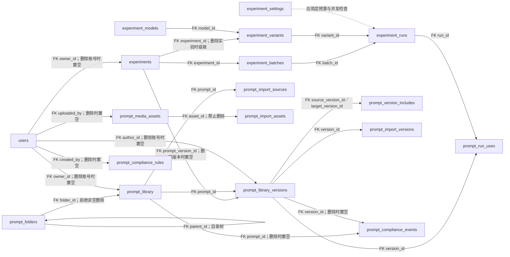

`experiments.record_kind` 区分未迁移内容的 `manual` 与可执行的 `definition`。旧手工记录保留原文、自评分和时间，缺少可靠创建者时只有管理员可管理。新定义的 `owner_id` 是真实账号外键；`task_id` 仍仅是逻辑关联。变体更新会停用旧变体并新建变体，旧运行继续引用原变体。运行保存请求时使用的提示词、参数、模型 API 名称、输入／输出单价快照及最终 token／延迟／成本，防止之后修改配置改写历史。运行队列依靠数据库状态在服务重启后恢复；模型密钥只在服务端环境变量中。

| 表 | 当前内容与关键关系 | 对应页面或功能 |
| --- | --- | --- |
| `experiment_settings` | 单行每日预算、并发上限和预留的 Judge 模型 ID。 | 实验管理员配置 |
| `experiment_models` | 模型目录、兼容 API 名称及美元／百万 token 输入输出单价。 | 实验变体选择、成本快照 |
| `prompt_library` | 提示词条目、标签、文件夹及软删除标记；创建者与文件夹为外键。 | `/prompts`、实验表单提示词来源 |
| `prompt_library_versions` | 不可变版本快照；旧整数版映射为 `0.0.N`，正文、类型、变量、消息结构和作者随版本保存。`prompt_id` 外键。 | `/prompts/:id`、实验定义选择固定版本 |
| `prompt_version_includes` | 固定版本间的直接引用边；源和目标版本均有外键。保存时检查引用链的循环与变量定义冲突。 | 提示词详情双向引用、运行时展开 |
| `prompt_run_uses` | 每次实验运行对直接及间接引用版本的归因事实；运行和版本均有外键，失败运行亦保留。 | 提示词版本统计、热度分析 |
| `prompt_import_sources` | 外部来源键和来源条目 ID 到本地提示词 ID 的稳定映射；重复导入避免复制。 | JSON/YAML 导入 |
| `prompt_import_versions` | 来源版本 ID 到本地不可变版本的映射；保持固定版本引用可重映射。 | JSON/YAML 版本导入 |
| `prompt_media_assets` | 本地受控图片、音频、视频附件元数据；上传账号有可置空外键，消息块中的附件 ID 由应用层校验。 | 提示词消息片段与实验运行 |
| `prompt_import_assets` | ZIP 来源键和附件 ID 映射到本地媒体，保存来源 SHA-256；同来源重复回导时复用附件，哈希变化则拒绝。`asset_id` 为外键。 | 提示词媒体 ZIP 回导 |
| `prompt_folders` | 可无限嵌套的共享目录；`parent_id` 自引用外键，非空目录不能删除。 | 提示词库侧栏 |
| `prompt_compliance_rules` | 管理员配置的受限自定义敏感信息模式。 | 提示词库合规管理 |
| `prompt_compliance_events` | 被拦截或明确确认后的扫描审计；提示词、版本与账号外键可置空。 | 提示词保存审计 |

LangFuse／LangSmith 的手动只读同步沿用 `prompt_import_sources` 和 `prompt_import_versions` 的来源映射及提示词合规扫描，不新建外部数据表。服务端凭据来自环境变量；复杂消息和无法无损映射的媒体版本会在预览中列为跳过，不落入数据库。
| `experiment_variants` | 一个实验定义的模型和参数组合；实验与模型均为外键。 | 实验详情、批量运行 |
| `experiment_batches` | 单次或 A/B 批次、变量输入、运行状态；实验和发起账号均为外键。 | 运行进度与汇总 |
| `experiment_runs` | 每个变体和输入组的独立执行、状态、响应、用量、主模型及 Judge 媒体价格快照；批次、实验和变体均为外键。 | 实验详情的运行结果 |

## 实验评测、标注、分享与调度

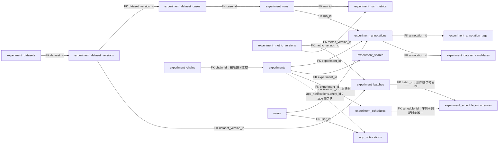

数据集版本固定用例清单，运行通过 `case_id` 记录对应输入。指标版本确定规则评分、Judge 提示词、通过门槛及退化阈值；规则和 Judge 的 0–5 分独立保存，再计算合成分。人工评分与自动分分开存储，人工标签只允许迁移中列出的七种值；标注可进入待审核候选池，不自动改写已发布数据集。版本链只在用户确认相似标题建议后设置稳定 `chain_id`。

分享表只保存随机令牌的哈希，公开页使用令牌查找最新配置和运行结果，过期或撤销后无法访问。调度记录以 `(schedule_id, due_at)` 唯一约束防止同一周期重复执行；账号时区用于计算下次运行时刻。`app_notifications.entity_id` 是应用层多类型关联，没有指向实验或调度的 SQL 外键；笔记复习仍保留原有专用通知表。

| 表 | 当前内容与关键关系 | 对应页面或功能 |
| --- | --- | --- |
| `experiment_metric_versions` | 规则类型、Judge 提示词、通过与退化门槛；由批次和运行指标引用。 | 回归设置与报告 |
| `experiment_datasets` | 数据集目录；创建账号外键可置空。 | `/experiments/datasets` |
| `experiment_dataset_versions` | 不可变的版本标识；`dataset_id` 外键。 | 数据集版本选择 |
| `experiment_dataset_cases` | 稳定用例键、变量、参考答案、难度与分类；版本外键。 | 回归逐项比较 |
| `experiment_run_metrics` | 单次运行的规则、Judge 和合成评分；运行与指标版本外键。 | 回归报告、自动评分 |
| `experiment_annotations` | 人工星级；实验、具体运行和评分账号外键，账号删除后匿名保留。 | 实验输出评分 |
| `experiment_annotation_tags` | 人工标签；标注外键和七值 CHECK。 | 实验输出标签 |
| `experiment_dataset_candidates` | 标注衍生的待审核候选；实验、运行、标注均为外键。 | 数据集候选池 |
| `experiment_chains` | 用户确认后的稳定版本链；创建账号外键。 | `/experiments/chains/:id` |
| `experiment_shares` | 只读分享的令牌哈希、期限、撤销时间；实验与创建者外键。 | `/share/experiments/:token` |
| `experiment_schedules` | 时区、频率、变量、重试、连续失败次数和下次执行时间；实验与账号外键。 | `/experiments/schedules` |
| `experiment_schedule_occurrences` | 每个计划周期与批次的持久关联；调度与批次外键。 | 定时运行恢复及去重 |
| `app_notifications` | 实验事件站内通知及可选邮件发送状态；账号外键。 | 顶部铃铛 |

## 评测数据集增量关系（019–020）

[019_evaluation_datasets.sql](../db/migrations/019_evaluation_datasets.sql) 新增文件夹、用例媒体引用，并扩展旧实验数据集；[020_evaluation_metrics.sql](../db/migrations/020_evaluation_metrics.sql) 扩展指标规则、分词版本和固定目标范围。图中实线均为 SQL 外键。

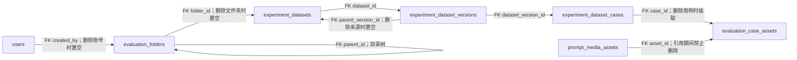

| 表 | 当前内容与关键关系 | 对应页面或功能 |
| --- | --- | --- |
| `evaluation_folders` | 无限层级目录；`parent_id` 自引用，非空目录不能删除。 | `/experiments/datasets` 文件夹浏览 |
| `evaluation_case_assets` | 用例与媒体附件的去重关联；两个 ID 都有外键，附件被引用时不能删除。 | 多模态用例保存、媒体配额核算 |

`experiment_dataset_cases` 现在还保存结构化输入、可选结构化参考答案、上下文、标签、1–5 难度、来源及期望工具调用。旧 `variables` 和 `reference_answer` 保留供已有实验运行读取。数据集子集保留创建时的固定 `parent_version_id`，来源版本的后续编辑不会改变子集。文件夹移动只更新目录元数据；用例内容修改必须新增版本。

## 自动运行、人工评测与退化告警（021–023）

[021_evaluation_run_details.sql](../db/migrations/021_evaluation_run_details.sql) 给运行指标增加逐项得分详情和重试上限；[022_evaluation_alerts.sql](../db/migrations/022_evaluation_alerts.sql) 保存退化告警；[023_evaluation_human_reviews.sql](../db/migrations/023_evaluation_human_reviews.sql) 保存双盲任务、分配和评分。

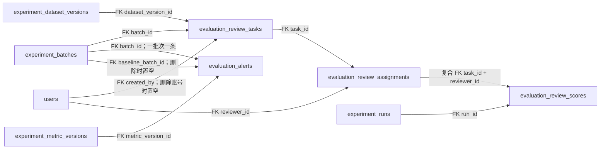

| 表 | 当前内容与关键关系 | 对应页面或功能 |
| --- | --- | --- |
| `evaluation_review_tasks` | 固定评测批次、数据集版本和四维评分标准；批次删除时级联。 | `/evaluation/reviews` |
| `evaluation_review_assignments` | 两位主评测员及争议后指派的仲裁员；任务和账号外键。 | 双盲待评队列 |
| `evaluation_review_scores` | 每账号每运行一份不可重复的四维 0–10 分；复合分配外键和运行外键。 | 一致性报告、争议仲裁 |
| `evaluation_alerts` | 单个回归批次的持久退化记录；关联固定 baseline 与指标版本。 | 退化告警和站内通知 |

`experiment_run_metrics.metric_details` 保存各内置指标的归一化得分、延迟与输出 token；`experiment_runs.retry_limit` 保存重试上限。跨版本比较使用 `case_key` 与输入、变量、上下文的指纹，数据库行 ID 只标识一个版本中的实例。双盲四维评分与实验输出的 1–5 星标注是不同数据，不能互相覆盖。

## 反馈候选与数据集发布（024–025）

[024_evaluation_candidates.sql](../db/migrations/024_evaluation_candidates.sql) 增加统一的会话／实验候选池；[025_evaluation_candidate_backfill.sql](../db/migrations/025_evaluation_candidate_backfill.sql) 将旧的 4–5 星标注补入候选池。候选来源标注 ID 因跨两种表而由应用层维护，图中虚线不是外键。

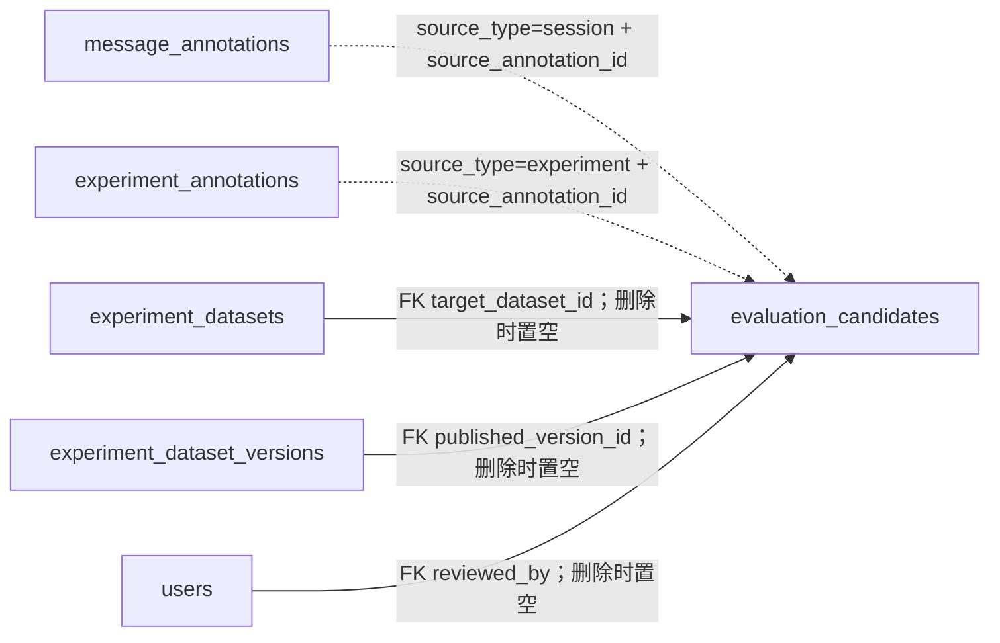

| 表 | 当前内容与关键关系 | 对应页面或功能 |
| --- | --- | --- |
| `evaluation_candidates` | 高分反馈的原始输入、输出、上下文、星级与审核状态；发布时指向目标数据集和新版本。 | `/evaluation/candidates` |

候选审核通过只进入暂存区，管理员的第二次操作将同一目标数据集的暂存条目批量追加到最新版本。原来的 `experiment_dataset_candidates` 仍保留供实验详情兼容读取；新的统一候选池同时收集会话反馈。

## 模型排行与定时评测（026–027）

[026_evaluation_metric_goals.sql](../db/migrations/026_evaluation_metric_goals.sql) 为指标版本保存固定目标区间。排行榜仅比较相同数据集版本与指标版本的已完成运行，按预设方向和区间归一化准确性、延迟和输出 token，再应用页面权重；不会依赖本次候选模型的最大最小值。[027_evaluation_schedules.sql](../db/migrations/027_evaluation_schedules.sql) 将计划和每次应执行的周期分开保存。

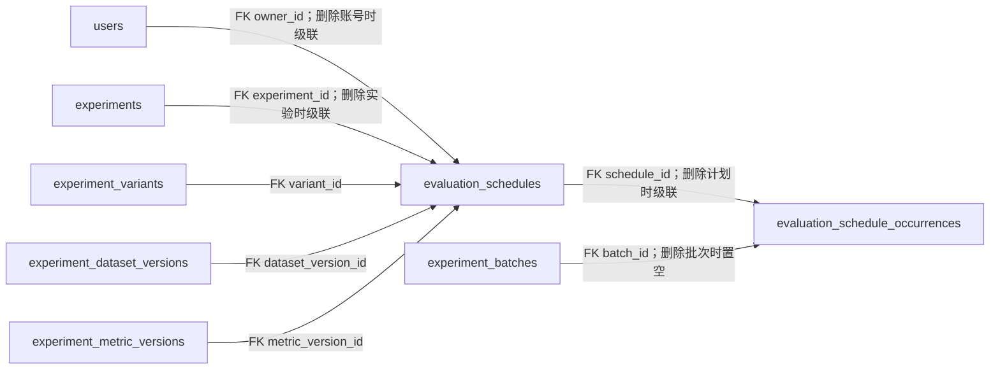

| 表 | 当前内容与关键关系 | 对应页面或功能 |
| --- | --- | --- |
| `evaluation_schedules` | 账号时区、每日／每周频率、固定数据集和指标版本、模型变体、下一执行时间；到期时行锁认领。 | `/evaluation/schedules` 创建、暂停、恢复、删除 |
| `evaluation_schedule_occurrences` | 每个计划时间唯一一条，记录批次与执行状态；重启补建时避免同周期重复提交。 | 立即执行、补建和失败通知 |

调度到期通过已有实验批次执行服务创建评测运行，逐项结果仍保存在 `experiment_runs` 和 `experiment_run_metrics`；通知保存在 `app_notifications`。删除计划会级联删除周期记录，已产生的批次和运行结果仍保留。排行榜页面为 `/evaluation/leaderboard`。

## 评测报告只读分享（028）

[028_evaluation_report_shares.sql](../db/migrations/028_evaluation_report_shares.sql) 增加一张报告分享表。分享链接只保存 SHA-256 令牌哈希、可选到期时间和撤销时间；创建人删除时置空，报告批次删除时级联。分享固定 `batch_id`，因此同批次的重试和结果更新反映在原链接，不会转到另一个批次。

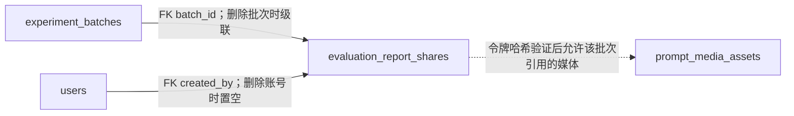

| 表 | 当前内容与关键关系 | 对应页面或功能 |
| --- | --- | --- |
| `evaluation_report_shares` | 固定报告批次、令牌哈希、期限和撤销状态；媒体权限通过运行用例与输出引用在应用层核查。 | `/experiments/reports/:id` 分享弹窗、`/share/evaluation-reports/:token` 公开页 |

## 账号、会话与人工评分

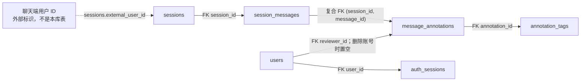

消息 ID 只要求在**同一会话内**唯一；`session_messages` 的主键为 `(session_id, id)`。评分表用 `(session_id, message_id)` 复合外键引用这两个字段。同一管理端账号对同一消息的有效评分由唯一索引限制为一条；删除评分账号时 `reviewer_id` 置空，原评分仍参与汇总。`annotation_tags.tag` 另有 [CHECK 约束](../db/migrations/002_constraints.sql)，只允许“准确、不准确、偏题、幻觉、过于冗长、过于简略、格式错误”七种标签。删除会话会级联删除消息、评分及其标签。`sessions.external_user_id` 不引用 `users.id`，不能把聊天端用户当成管理端评分账号。

| 表 | 当前内容与关键关系 | 对应页面或功能 |
| --- | --- | --- |
| `users` | 管理端账号、密码哈希、角色、启用状态及个人复习邮件设置。 | `/login`、`/accounts`、`/notes/reviews` |
| `auth_sessions` | 登录令牌哈希、到期与撤销时间；`user_id` 外键，删除账号时级联删除。 | 登录、退出、HTTP／WebSocket 鉴权 |
| `sessions` | 聊天端上报的会话；`external_user_id` 是外部用户标识。 | `/sessions` |
| `session_messages` | 会话中的 user／assistant 消息，保留顺序和首次确定的 ID；`session_id` 外键。 | 会话行内预览 |
| `message_annotations` | assistant 消息的 1–5 星评分；复合消息外键及可置空的评分账号外键。 | 会话消息下的评分和汇总 |
| `annotation_tags` | 一条评分可选的多个标签；`annotation_id` 外键，`tag` 受 `002_constraints.sql` 的七种标签 CHECK 约束。 | 会话消息下的标签人数 |

## 关联内容、活动与迁移元数据

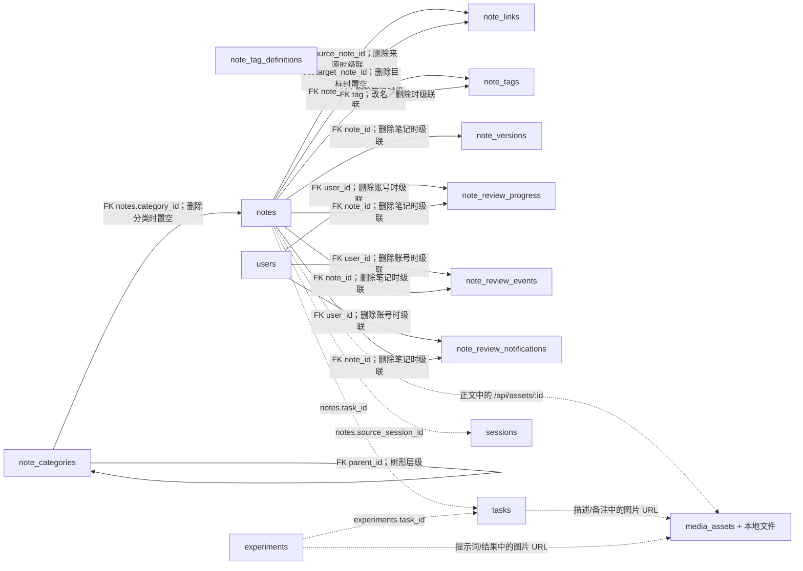

`note_links` 每行是一处正文引用，`source_note_id` 与 `target_note_id` 都有 SQL 外键。目标笔记删除后 `target_note_id` 置空，原引用文字和 `target_ref` 保留，页面显示红色虚线占位。`media_assets` 只存图片元数据，文件由本地 API 保存在 `mock/uploads/`；Markdown 字段里的图片 URL 是应用层引用，没有 SQL 外键。未被当前内容引用且已上传超过 24 小时的图片由服务定时清理。

`note_categories.parent_id` 形成可自定义的分类树，应用层拒绝间接循环；有子分类时不能删除父分类。删除叶子分类会把其笔记的 `category_id` 置空。`note_tag_definitions` 为每个笔记标签保存稳定 ID、显示名称和唯一规范化名称；`note_tags.tag` 通过名称外键引用它，改名和删除会级联到关联表。API 在同一事务中同步笔记标签数组，合并时去重。标签无笔记使用时仍留在目录和输入候选中，标签云只显示使用篇数大于零的标签。`note_tags` 与任务的 `task_tags` 完全分离；笔记列表可按分类及其子树、多个标签和标题／正文关键词组合筛选。

`note_versions` 每次保存标题和正文的完整快照，按 `(note_id, version_number)` 唯一；回滚会追加新版本。迁移前的笔记只生成当前内容的基线版本。知识图谱本身不另建表，`/api/knowledge-graph` 汇总 `notes`、`note_links`、`tasks` 和 `sessions`；笔记到任务和来源会话的关联仍由应用层维护。

下表中的笔记和实验 `task_id`、笔记 `source_session_id` 等字段用于当前页面的关联查询，但**没有 SQL 外键**。因此历史记录可以保留已删除实体的原始 ID；不能仅凭这些字段推断目标记录仍然存在。`note_links` 的两个笔记关联则有 SQL 外键。

| 表 | 当前内容与关键关系 | 对应页面或功能 |
| --- | --- | --- |
| `notes` | 笔记；`task_id`、`source_session_id` 分别记录关联任务和来源会话，均为逻辑关联。 | `/notes`、`/notes/:id`、任务详情“关联” |
| `note_categories` | 笔记分类树；`parent_id` 自引用外键。 | `/notes` 分类侧栏和分类管理 |
| `note_tag_definitions` | 笔记标签目录；稳定 ID、唯一名称及大小写归一键，允许零使用标签。 | `/notes` 标签候选与管理员管理入口 |
| `note_tags` | 笔记独立的多标签；`note_id` 和 `tag` 均有外键。 | `/notes` 标签云与筛选 |
| `note_links` | 笔记正文的双向引用；来源和目标均有外键，目标删除时保留悬空引用。 | `/notes/:id`、`/notes/graph` |
| `note_versions` | 每次保存或回滚产生的标题／正文快照；`note_id` 外键，删除笔记时级联删除。 | `/notes/:id` 历史版本、对比与回滚 |
| `note_review_progress` | 每账号每笔记一行；保存间隔阶段、轮次和到期日，账号与笔记均为级联删除外键。 | `/notes/reviews` |
| `note_review_events` | 每次完成复习的不可重复记录；账号、笔记均为级联删除外键，账号＋笔记＋轮次唯一。 | 复习面板勾选及历史核验 |
| `note_review_notifications` | 到期站内提醒、已读状态和邮件投递状态；账号、笔记均为级联删除外键，账号＋笔记＋轮次唯一。 | 顶部铃铛、邮件重试 |
| `media_assets` | 图片 MIME、大小、上传时间；文件存本地附件目录，内容字段通过 URL 逻辑引用。 | Markdown 编辑器及详情预览 |
| `experiments` | 手工记录或可执行实验定义；`task_id` 为逻辑关联，`owner_id` 与提示词版本为外键。 | `/experiments`、`/experiments/:id`、任务详情“关联” |
| `activity` | 创建、修改、完成等活动摘要；任务和操作者 ID 为逻辑关联。 | 仪表盘最近活动、任务早期活动 |
| `legacy_activity_ids` | 标记从旧 JSON 带来的活动 ID，便于与新字段历史分开展示；无外键。 | 任务详情“早期活动” |
| `task_trend_events` | 任务创建／完成等趋势事件；`task_id` 为逻辑关联。 | 仪表盘趋势折线图 |
| `task_trend_snapshots` | 某时点任务总数与进度总和的快照；无实体外键。 | 仪表盘累计平均进度 |
| `schema_migrations` | 已执行的 SQL 迁移版本与时间。 | `npm run db:migrate` |
| `data_imports` | 旧 JSON 导入文件的哈希与导入时间，防止重复导入。 | `npm run db:import` |

三个表组分别列出 15、6、17 张表，合计 38 张。复习表对账号和笔记使用真实外键；`generation` 是业务轮次，通过唯一约束防止重复提醒或复习记录，不是跨表外键。查看实际定义时以 SQL 迁移文件为准；图解释的是**当前实现**，未来添加外键或改变删除策略时，应同步更新本文。
